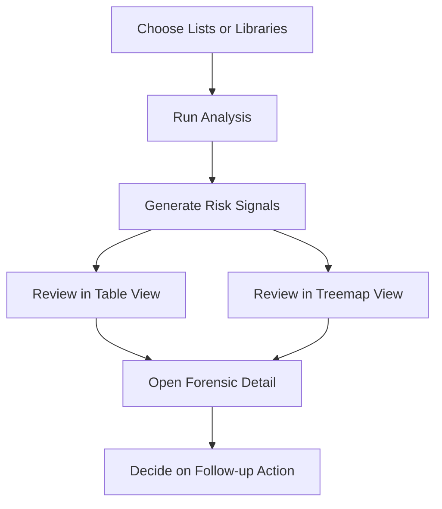

---
hide:
  - toc
---

<a href="../" class="btn-back">← Back to Web Parts Catalog</a>

# Features & Capabilities

The Permission Risk Heatmap (PRH) is built to help administrators and business reviewers move from raw SharePoint permissions to an actionable review process. Its value is not just in showing where risk exists, but in helping teams understand what they are seeing, decide what matters first, and follow through with the right next step.

## 1. Guided Review Workspace

PRH is designed as a guided workspace rather than a single chart or static report.

- **Analysis and History modes** let users switch between active review work and previously completed scan sessions.
- **Scope selection** helps reviewers choose the lists or libraries that should be included in a scan instead of forcing a one-size-fits-all review.
- **Step-based guidance** gives the page a clear operating flow so users can move from setup to analysis, interpretation, and follow-up without losing context.
- **Risk legend and visual status cues** make it easier to separate urgent findings from low-priority noise.

This matters because permission reviews often fail when teams have data but no usable process. PRH reduces that friction by keeping selection, analysis, and interpretation in one place.

!!! note "Image Placeholder"
    **Placeholder name:** `prh-guided-review-workspace.png`

    **What the final image should show:** the main PRH workspace with the left-side scope selector, the analysis and history tabs, the guided review steps, and the severity legend that helps users understand where to start.

    **Why this image matters:** this is the best point in the page to show users the overall working surface before the document goes deeper into analysis views and investigation details.

## 2. Risk-Based Analysis Experience

PRH analyzes selected content and surfaces permission conditions that deserve governance attention.

- **Risk scoring and prioritization** help teams focus on findings that deserve immediate review instead of reading raw permissions line by line.
- **Threshold-based sensitivity** allows administrators to tune how aggressively PRH surfaces findings.
- **Progress tracking** shows the state of scanned sources so reviewers can see which lists are still processing and which are complete.
- **Scan control** supports long-running review sessions by allowing operators to start, monitor, and stop analysis when needed.

The intent is practical: find the highest-value review targets first, not just produce a technically complete permission dump.

## 3. Multiple Review Views

PRH supports more than one way to read the results so different users can review findings in the format that helps them most.

- **Table view** is effective when reviewers want a structured list of findings they can sort, compare, and work through one by one.
- **Treemap view** helps users spot concentration patterns and high-risk clusters visually.
- **Severity indicators** provide a quick way to distinguish low, medium, and high concern areas while still allowing deeper inspection.
- **Search, pagination, and result navigation** support broader review sessions when the number of findings grows.

The best view depends on the user. Administrators may prefer a table for action tracking, while business stakeholders often understand the treemap faster during review meetings.

!!! note "Image Placeholder"
    **Placeholder name:** `prh-analysis-views-table-treemap.png`

    **What the final image should show:** the PRH findings area displaying either the table view, the treemap view, or both captured separately, with enough context to show how users switch between views and how severity is represented.

    **Why this image matters:** this section is where readers need to see the difference between structured review and visual review, because that choice shapes how they work through findings.

## 4. Forensic Drill-Down

PRH does not stop at a risk label. It helps users understand why a finding exists before they decide what to do.

- **User-level detail** helps reviewers identify who currently has access and whether that access looks intentional.
- **Group-level detail** shows when broad access may be coming from SharePoint groups or broader membership structures.
- **Guest visibility** helps expose external sharing conditions that often carry higher governance concern.
- **Reason context** makes it easier to explain why PRH raised the finding in the first place.

This is one of the most important parts of the product. A risk flag without explanation creates hesitation. Forensic detail creates confidence to act.

!!! note "Image Placeholder"
    **Placeholder name:** `prh-forensic-drilldown-panel.png`

    **What the final image should show:** the forensic detail experience for a selected finding, including the user, group, or guest access context and the reason the item was flagged.

    **Why this image matters:** this is the point where administrators and reviewers decide whether a finding is real, acceptable, or requires action, so the screenshot should make that decision-support value visible.

## 5. Remediation Support

Where permissions need to change, PRH supports action-oriented follow-up.

- **Seal** is useful when the current unique permission model is valid and should be intentionally preserved.
- **Re-inherit** helps restore alignment with parent permissions when unique access should no longer exist.
- **Purge** supports cleanup when exposure is no longer justified and access should be removed.

These actions should still follow your governance and approval model. The value of PRH is that it places remediation close to the finding, so teams can move from analysis to controlled action without losing the decision context.

## 6. Scan History and Session Review

PRH keeps scan sessions so reviews are not treated as one-time events.

- **History view** allows teams to reopen earlier analyses and continue from a known review point.
- **Session persistence** supports recurring governance cycles instead of forcing fresh manual reconstruction every time.
- **Before-and-after comparison** helps confirm whether remediation reduced exposure or simply changed where the risk appears.
- **Audit-oriented review** makes PRH more useful in governance meetings, control validation, and evidence preparation.

!!! note "Image Placeholder"
    **Placeholder name:** `prh-history-and-session-review.png`

    **What the final image should show:** the PRH history experience with previous scan sessions, enough visible metadata to understand that users can reopen earlier analyses, and the controls used to continue review from a prior run.

    **Why this image matters:** readers need to see that PRH is not a one-time scan surface. It supports recurring governance and evidence-based follow-up across multiple review cycles.

## 7. Operational Fit for Admins and Reviewers

PRH is useful because it serves more than one audience in the same review cycle.

- **Administrators** use it to run scans, tune sensitivity, investigate findings, and manage follow-up actions.
- **Site owners and business reviewers** use it to validate whether the flagged access still matches a real business need.
- **Governance stakeholders** use the outputs to understand risk posture over time rather than react to isolated incidents.

The result is a web part that supports both day-to-day operational review and broader governance conversations without forcing users into a deeply technical experience.
