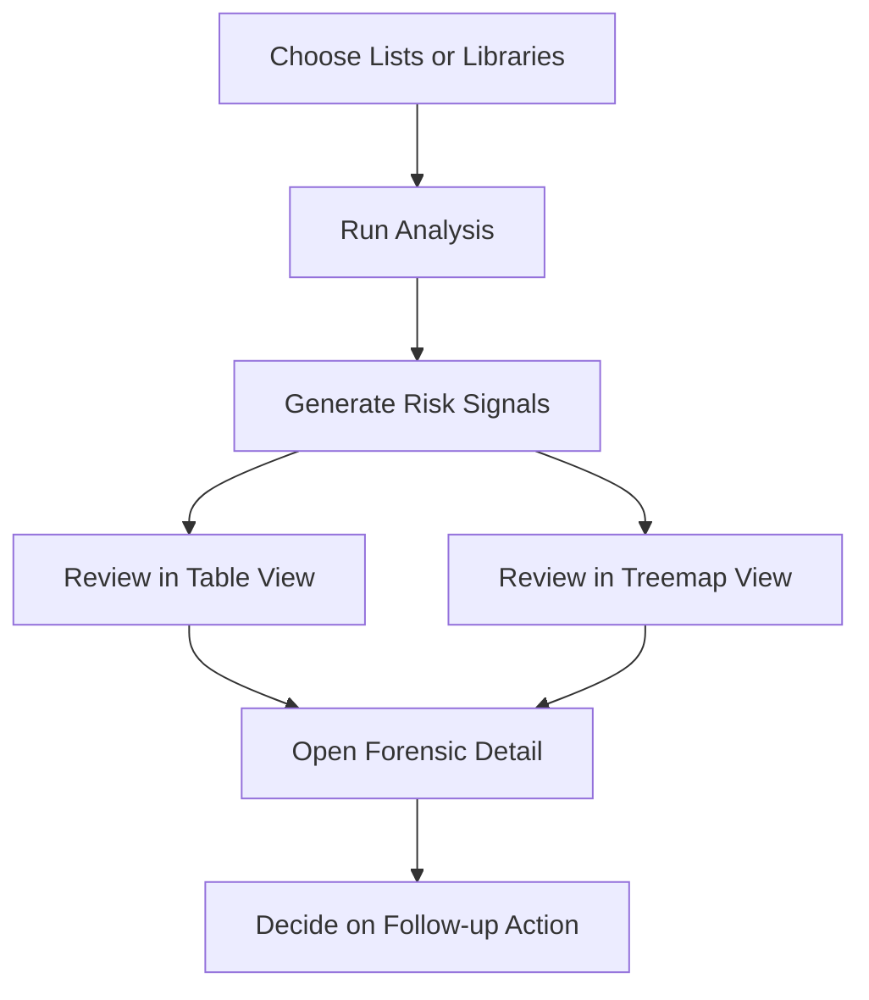

---
hide:
  - toc
---

<a href="../" class="btn-back">← Back to Web Parts Catalog</a>

# Features & Capabilities

The Permission Risk Heatmap (PRH) is built to help administrators and business reviewers move from raw SharePoint permissions to an actionable review process. Its value is not just in showing where risk exists, but in helping teams understand what they are seeing, decide what matters first, and follow through with the right next step.

## At a Glance

| Capability area | What PRH provides | Why it matters |
| :--- | :--- | :--- |
| `🧭` **Guided workspace** | A review-oriented surface with analysis, history, and scope selection | Helps users understand where to start and what to do next |
| `🚦` **Risk-led analysis** | Findings prioritized by risk conditions rather than raw permission output | Cuts down review noise and improves focus |
| `📊` **Multiple views** | Table and treemap review modes for different audiences and use cases | Makes the same findings easier to interpret in different ways |
| `🔎` **Forensic detail** | User, group, and guest-level context behind each finding | Builds confidence before any remediation decision |
| `🛠️` **Remediation support** | Action-oriented follow-up when policy and entitlement allow it | Keeps review and corrective action connected |
| `🕒` **History and continuity** | Session-based review continuity across repeated governance cycles | Supports validation over time, not just one-off scans |

## Guided Review Workspace

PRH is designed as a guided workspace rather than a single chart or static report.

| Workspace element | What users do there | What to pay attention to |
| :--- | :--- | :--- |
| `🛡️` **Analysis mode** | Run and review the current scan | Use this as the active working area for live review |
| `🕒` **History mode** | Reopen earlier scan sessions | Use this when validating changes over time |
| `📂` **Scope selection** | Choose lists or libraries for the scan | Start with a defined business scope instead of going too broad |
| `🪜` **Guided steps** | Follow the built-in review sequence | Helps teams move from selection to action without losing context |
| `🚥` **Risk legend** | Understand severity and prioritization | Use it to separate urgent findings from background noise |

!!! note "Image Placeholder"
    **Placeholder name:** `prh-guided-review-workspace.png`

    **What the final image should show:** the main PRH workspace with the left-side scope selector, the analysis and history tabs, the guided review steps, and the severity legend that helps users understand where to start.

    **Why this image matters:** this is the best point in the page to show users the overall working surface before the document goes deeper into analysis views and investigation details.

## Risk-Based Analysis Experience

PRH analyzes selected content and surfaces permission conditions that deserve governance attention.

| Analysis behavior | What it means in practice |
| :--- | :--- |
| **Risk scoring and prioritization** | Teams can focus on findings that deserve immediate review instead of reading raw permissions line by line |
| **Threshold-based sensitivity** | Administrators can tune how aggressively PRH surfaces findings |
| **Progress tracking** | Reviewers can see which lists are still processing and which are complete |
| **Scan control** | Operators can start, monitor, and stop analysis during longer review sessions |

The intent is practical: find the highest-value review targets first, not just produce a technically complete permission dump.

## Multiple Review Views

PRH supports more than one way to read the results so different users can review findings in the format that helps them most.

| View tab | Best use | Why it helps |
| :--- | :--- | :--- |
| `📋` **Table view** | Structured, action-oriented review | Better when users want to work through findings one by one |
| `🧊` **Grid view** | Card-based visual review | Better when users want richer summary cards without leaving the main result surface |
| `🫧` **Clusters view** | Pattern and tier grouping | Better when users want to understand how findings group by risk level and concentration |
| `🎯` **Radar view** | Signal-shape comparison | Better when users want to compare multiple forensic dimensions of a finding at once |

The best view depends on the question being asked. Table is best for action tracking. Grid is better for fast card-style scanning. Clusters helps show where findings are concentrating by tier. Radar helps explain why a single finding is strong across multiple dimensions.

### What Each Tab Is For

=== "📋 Table"

    Use this when you want the most direct operational review experience.

    **What it shows**
    - the result set in a structured row-based grid
    - sortable and reviewable findings for disciplined triage
    - the current page of results when the scan returns multiple pages

    **Best for**
    - structured triage
    - row-by-row investigation
    - repeatable review sessions where teams need to work methodically

    **What users should know**
    - this is the most practical default tab for day-to-day review
    - it works well when the admin needs to move through findings in order
    - opening a row takes the user into the deeper forensic experience

    <figure class="doc-screenshot">
      
      <figcaption>The Table tab is the most direct operational review surface, giving teams a structured way to triage findings one row at a time.</figcaption>
    </figure>

=== "🧊 Grid"

    Use this when you want a more visual card layout without losing result detail.

    **What it shows**
    - one card per finding
    - a visible risk score
    - summary cues such as external users, broken inheritance, resource type, and a visual heat bar
    - a compact sparkline-style visual trend element inside each card

    **Best for**
    - scanning many findings quickly
    - comparing summary metrics across results
    - review meetings where a dense table is harder to read

    **What users should know**
    - `Grid` is available across the usable plans
    - it is still a working review tab, not just a presentation view
    - large result sets still use pagination, and the card view is not intended to show everything at once on a single screen

    <figure class="doc-screenshot">
      
      <figcaption>The Grid tab turns findings into visual cards so users can scan risk scores and key signals faster without leaving the main review surface.</figcaption>
    </figure>

=== "🫧 Clusters"

    Use this when you want to understand how risk is grouping across the result set.

    **What it shows**
    - findings grouped into visual hubs by risk tier
    - separate regions for `Critical`, `High`, `Medium`, and `Safe / Compliant`
    - node-style visual grouping that helps users see where concentration is building up
    - hover-driven detail that supports deeper inspection without losing the cluster layout

    **Best for**
    - spotting concentration by risk tier
    - identifying where critical and high findings are piling up
    - governance review where pattern matters more than row detail

    **What users should know**
    - `Clusters` is a higher-tier view available only in Trial and Enterprise
    - it is designed for pattern reading, not row-by-row remediation work
    - it uses a bounded visible slice of the result set for usability, so it should be used to understand concentration rather than to replace detailed tabular review

    <figure class="doc-screenshot">
      
      <figcaption>The Clusters tab helps governance teams see where findings concentrate by tier, making risk patterns easier to read than a list alone.</figcaption>
    </figure>

=== "🎯 Radar"

    Use this when you want to understand the shape of a finding, not just its score.

    **What it shows**
    - a radar profile for each finding across multiple dimensions
    - dimensions such as `Sensitivity`, `External`, `Drift`, `Complexity`, and `Activity`
    - a severity label and score alongside the chart
    - supporting detail such as external users, groups, policy, and status

    **Best for**
    - comparing a finding across multiple forensic dimensions
    - explaining why one item is stronger or weaker than another
    - deeper review of priority items before remediation

    **What users should know**
    - `Radar` is available only in Trial and Enterprise
    - it is the most interpretation-heavy tab and works best once users already understand the finding
    - it still uses pagination when the result set is large, so it should be treated as an analytical view rather than a bulk-review surface

    <figure class="doc-screenshot">
      
      <figcaption>The Radar tab helps reviewers understand the shape of a finding across multiple dimensions such as sensitivity, external access, drift, complexity, and activity.</figcaption>
    </figure>

### View Availability by Plan

| View tab | Business | Trial | Enterprise |
| :--- | :--- | :--- | :--- |
| `📋` **Table** | Available | Available | Available |
| `🧊` **Grid** | Available | Available | Available |
| `🫧` **Clusters** | Locked | Available | Available |
| `🎯` **Radar** | Locked | Available | Available |

### View-Specific Notes

- `Table`, `Grid`, and `Radar` use paging when the result set is large.
- `Grid` is available in Business, Trial, and Enterprise.
- `Clusters` and `Radar` are not cosmetic add-ons; they are higher-tier visual intelligence views.
- Business users can still complete meaningful reviews with `Table` and `Grid`, but the advanced pattern and forensic visualizations are reserved for Trial and Enterprise.

!!! note "Image Placeholder"
    **Placeholder name:** `prh-analysis-tabs-table-grid-clusters-radar.png`

    **What the final image should show:** the PRH findings area with the full tab row visible, including `Table`, `Grid`, `Clusters`, and `Radar`, plus enough context to show which views are active or locked for the current plan.

    **Why this image matters:** this section now depends on the user understanding the tab model clearly. The screenshot should make the available and locked view options immediately obvious.

## Forensic Drill-Down

PRH does not stop at a risk label. It helps users understand why a finding exists before they decide what to do.

| Forensic area | What users learn |
| :--- | :--- |
| **User-level detail** | Who currently has access and whether that access looks intentional |
| **Group-level detail** | Whether broad access is coming from SharePoint groups or wider membership structures |
| **Guest visibility** | Whether external access is contributing to the risk signal |
| **Reason context** | Why PRH raised the finding in the first place |

This is one of the most important parts of the product. A risk flag without explanation creates hesitation. Forensic detail creates confidence to act.

!!! note "Image Placeholder"
    **Placeholder name:** `prh-forensic-drilldown-panel.png`

    **What the final image should show:** the forensic detail experience for a selected finding, including the user, group, or guest access context and the reason the item was flagged.

    **Why this image matters:** this is the point where administrators and reviewers decide whether a finding is real, acceptable, or requires action, so the screenshot should make that decision-support value visible.

## Remediation Support

Where permissions need to change, PRH supports action-oriented follow-up.

| Action | When it fits | Expected outcome |
| :--- | :--- | :--- |
| **Seal** | The current unique permission model is valid and should be intentionally preserved | Access is locked into the approved unique pattern |
| **Re-inherit** | Unique permissions should no longer exist | The item is brought back into alignment with parent permissions |
| **Purge** | Exposure is no longer justified and access should be removed | Unwanted access is cleaned up as part of the review cycle |

These actions should still follow your governance and approval model. The value of PRH is that it places remediation close to the finding, so teams can move from analysis to controlled action without losing the decision context.

## Scan History and Session Review

PRH keeps scan sessions so reviews are not treated as one-time events.

| History capability | Why it matters |
| :--- | :--- |
| **History view** | Teams can reopen earlier analyses and continue from a known review point |
| **Session persistence** | Recurring governance cycles do not require fresh manual reconstruction every time |
| **Before-and-after comparison** | Teams can confirm whether remediation actually reduced exposure |
| **Audit-oriented review** | PRH becomes more useful in governance meetings, control validation, and evidence preparation |

### History Retention and Storage

PRH history is only useful if users understand how long it is kept and where it is stored.

| History topic | Current behavior | What users should understand |
| :--- | :--- | :--- |
| **Session retention** | PRH keeps scan sessions so earlier reviews can be reopened | History is meant to support recurring review, not just the current scan |
| **Business plan retention** | Business policy limits history to up to **25 sessions** within a **30-day** lookback window | Older or excess sessions should not be assumed to remain available indefinitely on Business |
| **Enterprise or trial behavior** | Enterprise and full-trial behavior are designed for broader history access | These tiers are intended for longer and less restricted review continuity |
| **Browser session storage** | PRH currently persists history in browser local storage for the active site context | Users should not treat browser-only history as the sole long-term evidence store |
| **SharePoint history list boundary** | PRH is designed around a `PermissionRiskHistory` list pattern for SharePoint-backed history storage | Where organizations need stronger persistence and audit continuity, the SharePoint-backed model is the right direction |

!!! warning "History Reality Check"
    If a team needs durable audit evidence, do not rely only on browser-local history. Use PRH history as a working review surface and retain important outputs in the organization’s approved evidence path.

!!! note "Image Placeholder"
    **Placeholder name:** `prh-history-and-session-review.png`

    **What the final image should show:** the PRH history experience with previous scan sessions, enough visible metadata to understand that users can reopen earlier analyses, and the controls used to continue review from a prior run.

    **Why this image matters:** readers need to see that PRH is not a one-time scan surface. It supports recurring governance and evidence-based follow-up across multiple review cycles.

## Role Fit

PRH is useful because it serves more than one audience in the same review cycle.

=== "Administrators"

    PRH helps administrators run scans, tune sensitivity, investigate findings, and manage follow-up action without leaving the same review surface.

=== "Site Owners and Business Reviewers"

    PRH helps business stakeholders validate whether flagged access still matches a real business need before a remediation decision is made.

=== "Governance Stakeholders"

    PRH helps governance teams understand permission risk posture over time instead of reacting only to isolated findings.

The result is a web part that supports both day-to-day operational review and broader governance conversations without forcing users into a deeply technical experience.
