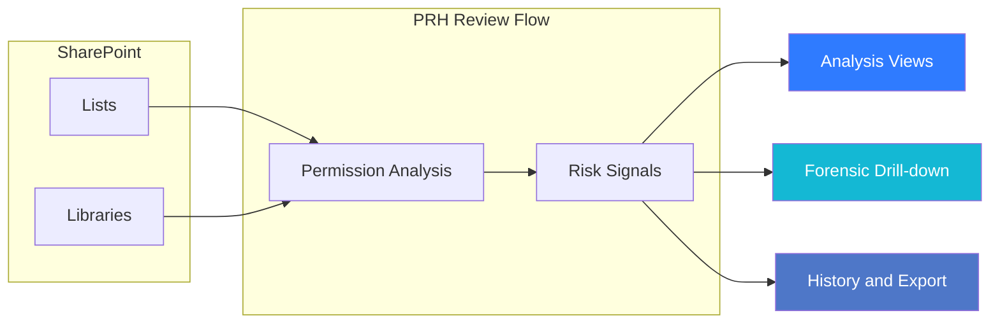

---
hide:
  - toc
---

<a href="../" class="btn-back">← Back to Web Parts Catalog</a>

# Overview & Setup

Permission Risk Heatmap (PRH) is a governance-focused SharePoint web part that helps administrators and business reviewers identify permission exposure, understand why it matters, and move from review to remediation without losing operational context.

It is designed for the situations where access risk is easy to create but hard to interpret: broad group assignments, externally exposed content, broken inheritance, and lists or libraries that no longer match their intended ownership model. Instead of forcing teams to inspect permissions manually one item at a time, PRH turns those signals into a guided analysis experience with history, drill-down, and remediation support.

<figure class="doc-screenshot">
  
  <figcaption>The PRH overview screen gives administrators and reviewers a clear starting point for scope selection, analysis, and follow-up action.</figcaption>
</figure>

## At a Glance

| Area | What PRH gives you | Why it matters |
| :--- | :--- | :--- |
| `🛡️` **Permission visibility** | A focused way to review selected SharePoint lists and libraries | Cuts through the noise of manual permission checking |
| `🚦` **Risk prioritization** | Severity-led findings instead of raw permission output | Helps teams decide what deserves attention first |
| `🔎` **Forensic context** | User, group, and guest-level detail behind each finding | Reduces hesitation before remediation |
| `🛠️` **Follow-up action** | Remediation-oriented workflows close to the findings | Keeps review and action in the same working context |
| `🕒` **Review continuity** | History and session reuse | Supports recurring governance rather than one-time audits |
| `📤` **Evidence support** | Export-friendly review output | Helps with governance review, audit, and follow-up tracking |

## Core Experience

PRH is organized around a practical review flow rather than a purely technical screen layout.

| Step | What happens | What users should focus on |
| :--- | :--- | :--- |
| `1.` `📂` **Scope selection** | Users choose the lists or libraries to review | Start with a defined scope instead of scanning too broadly |
| `2.` `🚀` **Guided analysis** | PRH evaluates the selected sources and generates risk signals | Look for unique permissions, guest exposure, broad access, and other risk patterns |
| `3.` `📊` **Review and drill-down** | Findings can be reviewed in table or treemap views with forensic detail | Understand who has access, why the item was flagged, and whether the exposure is acceptable |
| `4.` `🔧` **Remediation and follow-up** | Teams can move from review into approved corrective action and later re-check the results | Focus on safe remediation, traceability, and validation over time |

## Why It Matters

PRH is useful because SharePoint permission risk is rarely obvious from the page where the content lives. Exposure often comes from accumulated changes over time: extra owners, inherited drift, guest sharing, or one-off exceptions that became permanent. PRH helps teams review those patterns as an operational process instead of a manual investigation.

## Who This Is For

| Role | What they use PRH for | Expected outcome |
| :--- | :--- | :--- |
| **Administrators** | Run scans, review high-risk findings, and coordinate follow-up | Critical findings are triaged and handled with evidence |
| **Site owners** | Confirm whether current access still matches business need | Legitimate access is preserved and unnecessary access is challenged |
| **Business reviewers** | Validate whether flagged access is acceptable or risky | Decisions are based on context, not assumption |
| **End users** | Understand why access changed after governance review | Fewer surprises and faster issue confirmation after remediation |

## Prerequisites and Readiness

Before using PRH effectively, confirm the basics below.

| Readiness area | What should already be true |
| :--- | :--- |
| **Environment** | SharePoint Online modern experience is in use |
| **Permissions** | The operator has enough access to review the target site and its relevant lists or libraries |
| **Deployment** | The PRH solution is already deployed to the target tenant or environment |
| **Business ownership** | The reviewed scope has a known business owner before remediation starts |
| **Review intent** | The team knows whether the session is for discovery, recurring review, or remediation validation |

## Quick Setup Guide

Use the following setup flow when PRH is being added to a page for the first time.

### 1. Add to Page

1. Navigate to the SharePoint page where you want to perform reviews.
2. Enter **Edit** mode.
3. Click the **+** (plus icon) to add a new web part.
4. Search for **"Permission Risk Heatmap"** and select it.

### 2. Configure Basic Properties

1. Select the PRH web part and click the **Pencil icon** to open the property pane.
2. **Title**: Set a descriptive title for the review surface.
3. **Risk Sensitivity**: Adjust the threshold slider to determine how aggressively PRH surfaces risk.
4. **Mock Data**: Enable mock mode if you want to demonstrate or test the experience without scanning live content.
5. **List Logging**: Enable list logging when your operating model requires additional persistence for governance records.
6. **Telemetry Settings**: Where configured, align telemetry behavior to your tenant or admin guidance rather than treating it as a casual toggle.

### 3. Run Your First Scan

1. **Save and Publish** the page.
2. In the PRH workspace, select the lists or libraries you want to review.
3. Start the scan from the analysis view.
4. Review the initial findings in the default analysis experience.
5. Open forensic details to understand which users, groups, or guests are contributing to the risk signal.
6. Use history after later review cycles to compare outcomes and confirm whether remediation changed the risk profile.

!!! tip "Simulation Mode"
    If you want to explore the interface before using live SharePoint data, enable **Use Mock Data** in the property pane. This is the safest way to walk stakeholders through the experience before the first real review cycle.

---

## What to Read Next

1. Explore [Features & Capabilities](features.md) to understand the analysis workspace, views, and visual review model.
2. Review [Roles & Workflows](operating-model.md) to understand who does what and how PRH should be used in a real review cycle.
3. Read [Administration & IT](administration.md) for PRH scope boundaries, history behavior, and environment expectations.
4. Read [Commercials & Licensing](licensing.md) to understand plan behavior, activation, and entitlement review.
5. Use [Troubleshooting](troubleshooting.md) when a scan, history session, or export flow does not behave as expected.
