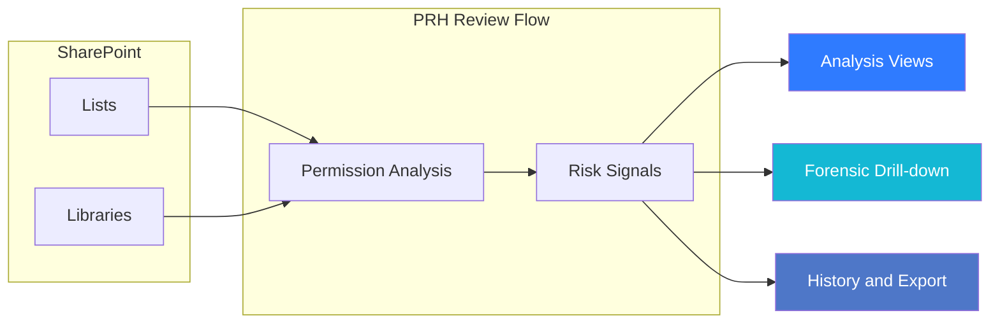

---
hide:
  - toc
---

<a href="../" class="btn-back">← Back to Web Parts Catalog</a>

# Overview & Setup

Permission Risk Heatmap (PRH) is a governance-focused SharePoint web part that helps administrators and business reviewers identify permission exposure, understand why it matters, and move from review to remediation without losing operational context.

It is designed for the situations where access risk is easy to create but hard to interpret: broad group assignments, externally exposed content, broken inheritance, and lists or libraries that no longer match their intended ownership model. Instead of forcing teams to inspect permissions manually one item at a time, PRH turns those signals into a guided analysis experience with history, drill-down, and remediation support.

!!! note "Image Placeholder"
    **Placeholder name:** `prh-overview-main-screen.png`

    **What the final image should show:** the main PRH landing experience with scope selection, the analysis workspace, risk summary context, and the primary actions a reviewer uses to begin a scan.

    **Why this image matters:** this should give administrators and business reviewers an immediate visual understanding of where they start, what they can review, and how PRH turns SharePoint permission data into an operational risk review experience.

## What PRH Helps You Do

- Identify overshared lists, libraries, and uniquely permissioned items faster.
- Detect guest exposure and broad-access patterns that deserve governance review.
- Prioritize risk using severity scoring instead of raw permission data alone.
- Inspect forensic context before deciding whether remediation is safe.
- Reopen previous scan sessions through history so teams can compare outcomes over time.
- Export evidence and preserve traceability for audit, governance, or review meetings.

## Core Experience

PRH is organized around a practical review flow rather than a purely technical screen layout.

### 1. Scope selection

Users start by choosing one or more SharePoint lists or libraries. The experience supports focused review by scope, which is important because large first-time scans often create more noise than action.

### 2. Guided analysis

Once a scan starts, PRH evaluates the selected sources and generates risk signals for list-level and item-level permission conditions. This includes:

- unique permission breaks
- external access presence
- broad or potentially over-permissioned assignments
- naming-based sensitivity heuristics
- estimated risk value and score breakdown

### 3. Review and drill-down

Results can be reviewed in analysis views such as table and treemap mode, with forensic context for users, groups, and guest access. This allows reviewers to understand not only that something is risky, but also who is involved and why the signal exists.

### 4. Remediation and follow-up

Where policy and licensing allow, PRH supports remediation actions such as sealing permissions, re-inheriting permissions, or purging access. It also supports session history so teams can re-open earlier scans and verify what changed after follow-up action.

## Why It Matters

PRH is useful because SharePoint permission risk is rarely obvious from the page where the content lives. Exposure often comes from accumulated changes over time: extra owners, inherited drift, guest sharing, or one-off exceptions that became permanent. PRH helps teams review those patterns as an operational process instead of a manual investigation.

## Intended Audience

- **Administrators** who run recurring permission-risk reviews.
- **Site owners** who validate whether access still supports a real business need.
- **Business reviewers** who help decide whether a finding is acceptable, risky, or needs remediation.
- **End users** who need to understand why access changed after a governance review.

## Prerequisites and Readiness

Before using PRH effectively, make sure the following are in place:

- **Environment**: SharePoint Online (Modern Experience).
- **Permissions**: At minimum, the user needs enough access to review the target site and its relevant lists or libraries. In practice, the most effective reviews happen when the operator also has the authority to coordinate follow-up action.
- **Deployment**: The PRH solution package must already be deployed to the tenant or target environment.
- **Governance context**: PRH works best when the business owner for the reviewed scope is known before remediation discussions begin.
- **Operational readiness**: Teams should already know whether they are running PRH for discovery, recurring review, or remediation validation.

## Quick Setup Guide

Use the following setup flow when PRH is being added to a page for the first time.

### 1. Add to Page

1. Navigate to the SharePoint page where you want to perform reviews.
2. Enter **Edit** mode.
3. Click the **+** (plus icon) to add a new web part.
4. Search for **"Permission Risk Heatmap"** and select it.

### 2. Configure Basic Properties

1. Select the PRH web part and click the **Pencil icon** to open the property pane.
2. **Title**: Set a descriptive title for the review surface.
3. **Risk Sensitivity**: Adjust the threshold slider to determine how aggressively PRH surfaces risk.
4. **Mock Data**: Enable mock mode if you want to demonstrate or test the experience without scanning live content.
5. **List Logging**: Enable list logging when your operating model requires additional persistence for governance records.
6. **Telemetry Settings**: Where configured, align telemetry behavior to your tenant or admin guidance rather than treating it as a casual toggle.

### 3. Run Your First Scan

1. **Save and Publish** the page.
2. In the PRH workspace, select the lists or libraries you want to review.
3. Start the scan from the analysis view.
4. Review the initial findings in the default analysis experience.
5. Open forensic details to understand which users, groups, or guests are contributing to the risk signal.
6. Use history after later review cycles to compare outcomes and confirm whether remediation changed the risk profile.

!!! tip "Simulation Mode"
    If you want to explore the interface before using live SharePoint data, enable **Use Mock Data** in the property pane. This is the safest way to walk stakeholders through the experience before the first real review cycle.

---

## What to Read Next

1. Explore [Features & Capabilities](features.md) to understand the analysis workspace, views, and visual review model.
2. Review [Roles and Operating Model](roles-and-operating-model.md) to define who performs scans, who validates findings, and who approves changes.
3. Follow the [Workflow Guide](workflow-guide.md) for the end-to-end PRH review process.
4. Use [Troubleshooting](troubleshooting.md) when a scan, history session, or export flow does not behave as expected.
5. Read [Platform Notes](architecture.md) for boundary and system-behavior context without going into deep technical architecture.
