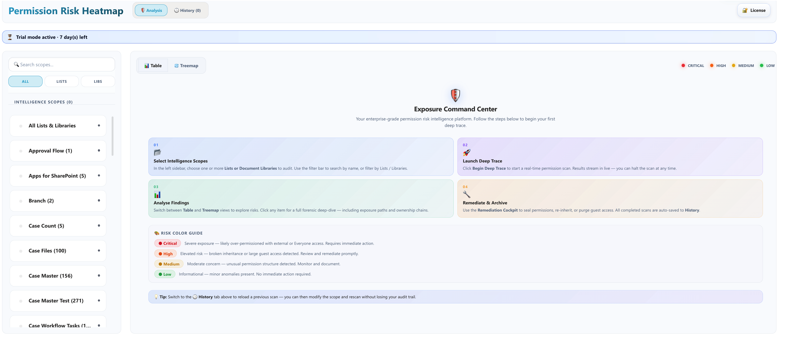

---
hide:
  - toc
---

# Workflow Guide

This page combines the operational PRH workflow into one scrollable guide, from first-run setup through analysis, findings review, remediation, and reporting.

## Getting Started

Use this section before your first operational PRH review cycle.

### What Access Is Needed

- Access to the PRH web part and the target SharePoint scope being reviewed.
- The ability to review findings and, where applicable, participate in remediation decisions.
- Access to the governance or approval path used by your organization for high-impact changes.

### When to Use PRH

- Before scheduled governance reviews.
- After major permission changes in important business areas.
- During remediation follow-up to confirm the new state.
- When teams need evidence of what was reviewed and why action was taken.

### How to Choose Scope

- Start with one high-value list or library.
- Use narrower scopes when the first run is likely to require quick action.
- Expand scope only after the team is comfortable with triage and validation.

### First-Run Checklist

- Identify the business owner for each scope you plan to review.
- Confirm who can approve high-impact remediation decisions.
- Decide whether the goal is baseline discovery, recurring review, or remediation verification.
- Agree how findings and exports will be stored for governance follow-up.

## Run an Analysis

<figure class="doc-screenshot">
  
  <figcaption>Administrators begin a PRH review cycle by selecting a scope, launching analysis, and then moving into findings review.</figcaption>
</figure>

### Before You Start

- Confirm the target SharePoint area and its business owner.
- Choose whether the run is exploratory, operational, or remediation verification.
- Decide whether the scope should be broad enough for trend review or narrow enough for a focused action cycle.

### Standard Analysis Workflow

1. Select the target scope from the left navigation rail.
2. Confirm you are on the `Analysis` tab.
3. Start the PRH scan for the selected scope.
4. Monitor findings as they populate.
5. Watch for severity patterns, unusually broad access, and signs that the scope may be too large for one action cycle.
6. Prioritize critical and high findings first.
7. Validate business impact before remediation decisions are made.
8. Save or export evidence for the review cycle.

### What Happens During Analysis

- PRH evaluates the selected scope and groups results into actionable findings.
- Operators can review findings through both `Table` and `Treemap` views.
- The severity model helps teams focus on the most important exposures first.

### If the Scope Is Too Broad

- Stop expanding the review and narrow the scan to a smaller business area.
- Triage the highest-value or highest-risk scope first.
- Use history and reporting later for broader trend analysis rather than trying to remediate everything in one pass.

## Review and Interpret Findings

This section explains how to interpret PRH findings before any remediation action is taken.

### Severity Meanings

- `Critical` indicates likely severe exposure or unusually broad access that needs immediate review.
- `High` indicates material risk that should be reviewed and remediated promptly.
- `Medium` indicates a meaningful concern that should be documented and prioritized.
- `Low` usually indicates an informational or lower-urgency anomaly.

### Common Risk Patterns

- External users or guest access retained longer than expected.
- Broad group access that no longer matches the business need.
- Permission inheritance patterns that make ownership unclear.
- Access structures that are difficult to justify during review.

### How to Decide What Matters First

1. Critical findings with clear exposure risk.
2. High findings in high-value or regulated business areas.
3. Findings affecting external access or unclear ownership.
4. Medium findings that recur across multiple reviews.

### How to Validate Business Impact

- Confirm whether the access still supports a current business process.
- Verify who should retain access and who should not.
- Check whether a change would interrupt time-sensitive work.
- Involve the business owner before moving to remediation where impact is uncertain.

## Remediate and Archive

This section covers how to move from validated findings into safe remediation and proper recordkeeping.

### Approval Expectations

- Low-impact changes can move faster when ownership and effect are clear.
- High-impact changes should follow the organization’s approval or change-control process.
- Exceptions should be documented with an owner and review date.

### Remediation Workflow

1. Confirm the finding is valid.
2. Validate business impact with the owner or reviewer.
3. Capture pre-change evidence.
4. Apply the approved remediation.
5. Re-scan to confirm the outcome.
6. Archive the result with notes and evidence.

### Safe-Change Guidance

- Apply the smallest safe change possible.
- Avoid broad access changes without known ownership.
- Separate urgent remediation from wider cleanup if the blast radius is unclear.

### Re-Scan Expectations

- Re-scan immediately after a material remediation where possible.
- Compare the new result with the previous state through history.
- Keep unresolved items visible for follow-up rather than closing them implicitly.

### Recordkeeping

- Store the scan scope, approval notes, and remediation summary.
- Retain pre-change and post-change evidence.
- Keep a concise audit trail that explains what changed and why.

## History, Reports, and Audit Evidence

PRH is not only for finding risk in the moment. It is also a record of what was reviewed, what changed, and how the organization responded.

### Reopen Earlier Runs

- Use history after remediation to confirm the new state.
- Reopen prior runs before governance meetings to compare review cycles.
- Use prior runs during audits to show when a scope was scanned.

### Compare Outcomes

- Compare like-for-like scopes when showing trend movement.
- Explain major risk reductions with both the action taken and the business justification.
- Keep unresolved findings visible instead of excluding them from summary views.

### Export Evidence

- Retain scan date and time.
- Retain the scope reviewed.
- Retain high-priority findings.
- Retain approval or validation notes.
- Retain remediation actions taken and follow-up scan results.

### Governance Review Usage

- Use PRH reporting for governance steering updates.
- Use it for monthly or quarterly risk reviews.
- Use it for remediation follow-up meetings.
- Use it to assemble audit evidence packs.
